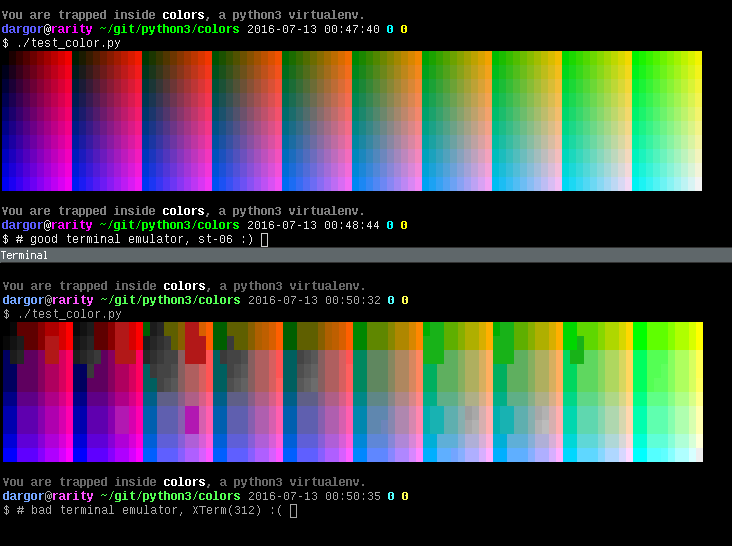
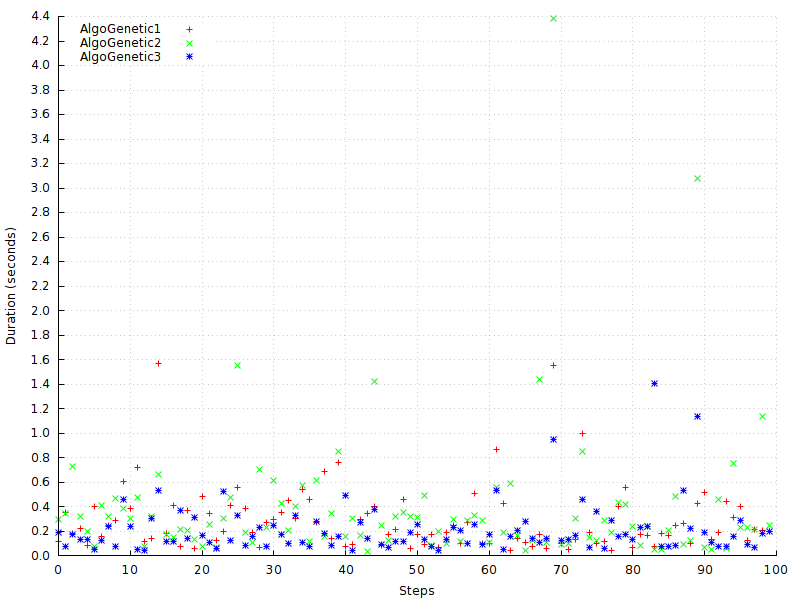

# Colors, algorithms and fun

A standard `#RRGGBB` color is a 24-bit number, meaning it has `256^3` = `16777216` possible combinations (!).

I wondered how genetic algorithms worked, and how many iterations would be needed to find a given color.

I thought it was a good choice, because colors are easy to compare, right ?


## Quick note about terminal emulators

I lost some time wondering why my algorithms sometimes returned me colors that did not match, so I warn you : terminal emulators more or less correctly implement true colors, which are needed in our use case.

You can test your terminal emulator by running `./test_color.py` :


If you don't have a nice output, try [st](http://st.suckless.org/) : it's easy to compile and run locally, no need to install it as root !
```bash
wget http://dl.suckless.org/st/st-0.6.tar.gz
tar xzf st-0.6.tar.gz
cd st-0.6/
make
tic -s st.info
./st &
```
And voilà, ready to run with some nice colors !

## run.py

This is the benchmark main entry point.

```
$ ./run.py -h
usage: run.py [-h] -a {random,brute,genetic1,genetic2,genetic3} [-c COLOR]
              [-d DELAY] [-f FITNESS] [-i ITERATIONS] [-p POPULATION_SIZE]
              [-s SEED]

optional arguments:
  -h, --help            show this help message and exit
  -a {random,brute,genetic1,genetic2,genetic3}, --algorithm {random,brute,genetic1,genetic2,genetic3}
                        Algorithm to run
  -c COLOR, --color COLOR
                        Color to find
  -d DELAY, --delay DELAY
                        Delay between each iteration
  -f FITNESS, --fitness FITNESS
                        ΔE considered acceptable
  -i ITERATIONS, --iterations ITERATIONS
                        Number of iterations
  -p POPULATION_SIZE, --population-size POPULATION_SIZE
                        Size of population at each iteration
  -s SEED, --seed SEED  Seed to initialize the random number generator
```

Play with the various options, but the only really useful one is `-a`.

## But what's a ΔE, my precious ?

It's a measure of distance between two colors, lesser being closer.

The `wikipedia` page and `python-colormath` documentation explain everything :
* https://en.wikipedia.org/wiki/Color_difference
* http://python-colormath.readthedocs.io/en/latest/

ΔE are noted below their corresponding colors in the output of `run.py`.

The `-f` option sets the minimum ΔE value required to pass the test, and default to `1.0`.

## Algo*.py

All our algorithms derive an abstract base class `Algo`, which is used by `run.py` to abstract annoying details.

The base population of all algorithms is randomly chosen.

## AlgoBrute.py

Brute force, the worst possible thing to do when you have 16 millions of combinations.

```
$ ./run.py -a brute -s 42
[...]
Color to find   : ████ #390C8C
Color found     : ████ #330A8B (ΔE = 0.980)
Iterations      : 139377
Population size : 24
Colors tested   : 3345048
All that in     : 789.034 seconds
```

This one erases the default random population to set its own, which allows it to try `N` (`N` being the population size) variations at each iteration.

## AlgoRandom.py

Random, not necessarily a bad idea.

```
$ ./run.py -a random -s 42
[...]
Color to find   : ████ #390C8C
Color found     : ████ #3A0892 (ΔE = 0.896)
Iterations      : 516
Population size : 24
Colors tested   : 12384
All that in     : 2.984 seconds
```

This one has absolutely no subtlety : it generates a new random population at each iteration.

## AlgoGenetic.py

Base abstract class for genetic algorithms : selection, reproduction and mutations are taken care of by this abstract class.

The fittest parents get many mating possibilities, while the lesser ones get only a few mating opportunities (but they still get at least one, to preserve our genetic pool diversity).

When we have enough children, we keep the best ones to form a new generation.

After some iterations, the algorithm converges to a quite good solution.

See this [page](https://en.wikipedia.org/wiki/Genetic_algorithm) for more details on genetic algorithms.

An actual genetic algorithm must at least define `OPS` (available crossover operations) and `crossover` (their implementations).

## AlgoGenetic1.py

```
$ ./run.py -a genetic1 -s 42
[...]
Color to find   : ████ #390C8C
Color found     : ████ #360D8A (ΔE = 0.539)
Algorithm       : AlgoGenetic1
Iterations      : 15
Population size : 26
Colors tested   : 390
All that in     : 0.149 seconds
```

This one simply combines bits together, trying to maximize diversity.

Works quite well.

## AlgoGenetic2.py

```
$ ./run.py -a genetic2 -s 42
[...]
Color to find   : ████ #390C8C
Color found     : ████ #391090 (ΔE = 0.861)
Algorithm       : AlgoGenetic2
Iterations      : 13
Population size : 26
Colors tested   : 338
All that in     : 0.131 seconds
```

This one is an artificial equivalent of how natural crossover works, trying to enhance each generation fitness.

Can be really slow to converge, but its solutions are quite good.

## AlgoGenetic3.py

```
$ ./run.py -a genetic3 -s 42
[...]
Color to find   : ████ #390C8C
Color found     : ████ #36078C (ΔE = 0.717)
Algorithm       : AlgoGenetic3
Iterations      : 10
Population size : 26
Colors tested   : 260
All that in     : 0.096 seconds
```

This one combines both approaches, merging their strengths.

Best average performance.

## Durations over 100 runs

Data and scripts used in `bench.*`.



```
$ ./bench.sh
[...]
AlgoGenetic1 : .290 seconds (mean time)
AlgoGenetic2 : .393 seconds (mean time)
AlgoGenetic3 : .212 seconds (mean time)
```

## License

ISC.
